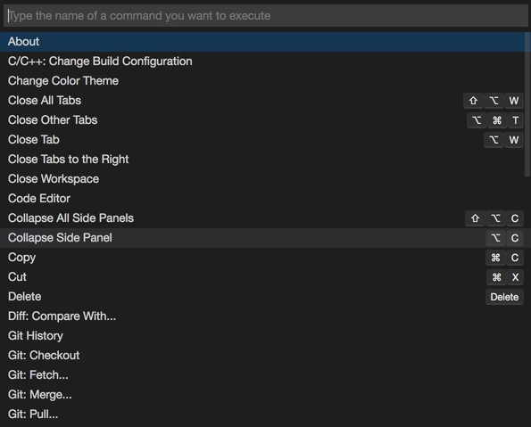
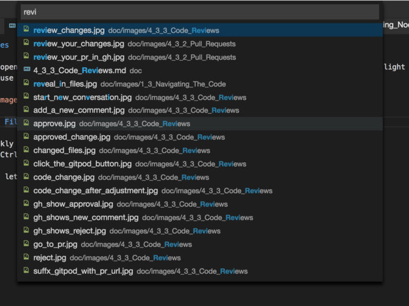

# Tips & Tricks

Below you find a list of tips and tricks to the most useful tools.

## Command Palette

The command palette is the center for a keyboard-centric interaction as well as for looking up available commands and keybindings. It is available through the following two keybindings:
 - <kbd>F1</kbd> 
 - <kbd>Ctrl</kbd>+<kbd>Shift</kbd>+<kbd>P</kbd> (<kbd>⌘</kbd>+<kbd>Shift</kbd>+<kbd>P</kbd> on macOS)

### The Command Palette is Contextual

The **Command Palette** contains all commands that are available from the application. Many of the accessible commands are context dependent. 
That means only those commands are visible that are active at the moment. For example, the `Go To Line...` command is only available when a code editor is opened and has focus.

## Color Themes

Gitpod opens in its **dark theme**. If you prefer a lighter experience, you can switch to the light theme.
Simply use the command palette and choose **Change Color Theme**.

## Open File

To quickly open any file using the keyboard, press
- <kbd>Ctrl</kbd>+<kbd>P</kbd> (<kbd>⌘</kbd>+<kbd>P</kbd> on macOS)

It will let you quickly search, find and open any file by name.

## Search in Workspace

To search for or replace string occurences in all files of your workspace press:
- <kbd>Ctrl</kbd>+<kbd>Shift</kbd>+<kbd>F</kbd> (<kbd>⌘</kbd>+<kbd>Shift</kbd>+<kbd>P</kbd> on macOS)

It opens the search view, which is described in more detail [here](56_Search.md).

## Symbols and References

Most languages allow to name things and refer to them in other places, for example variables, 
functions, classes, modules etc. Gitpod supports this notion of such _symbols_ and _references_
to them and allows to navigate in both directions: 

- `Open Symbol` (<kbd>CTRL</kbd>-<kbd>SHIFT</kbd>-<kbd>O</kbd>) finds a symbol by its name.
- `Find All References` (<kbd>SHIFT</kbd>-<kbd>F12</kbd>) lists all references to the symbol 
at the current position in an inline editor.
- `Go to Definition` (<kbd>CTRL</kbd>-<kbd>F12</kbd> or <kbd>CTRL/⌘</kbd>-click) brings you to  
the definition of a symbol. `Peek Definition` (<kbd>ALT</kbd>-<kbd>F12</kbd>) does the same 
an inline editor
- `Rename Symbol` (<kbd>F2</kbd>) renames the symbol and all references to it.
